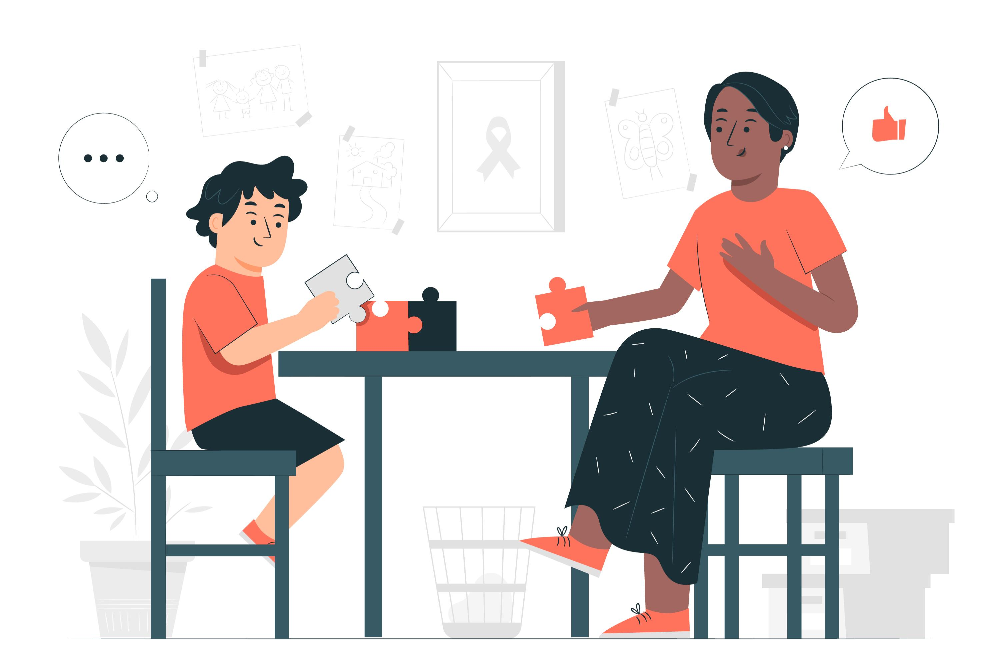

<h1 align="center">Have a Walk With me</h1>

<h3 align="center">A step towards inclusivity of autism.</h3>

## Inspiration
With the new normal and digitalization of every sector, we came to realise that there are mostly blogs available on the internet on Autism and felt that the Autism community was somewhere sidelined with having barely any resources or software which could help the parents and therapists continue their therapies virtually and still had to depend on traditional means of crafts etc to develop puzzles for children to teach life skills. On more surfing around the internet, we realised the gravity of the situation when there was only one website that had educational games teaching autistic kids eye contact etc. which had also been discontinued because of technical glitches. The severity of the situation alongside the fact that 1 in 54 children have autism inspired us to use technology to create tools catering to the needs of the children, parents and people associated with autism. Spreading awareness about Autism through our project has been the major driving force.

## What it does
Walk with me is a working prototype aimed at incorporating technology into the traditional tools used in teaching people with autism basic life skills. The project is coded in colour blue and has the puzzle logo which is symbolic of autism and has been incorporated with the aim to spread awareness. The project has three distinct highlights aimed at trying to cover people who are on different levels of the autism spectrum. Special Educators use traditional means of making adaptive books to teach life skills like brushing teeth etc and to reduce the cumbersome workload in making work system using handcrafts, we decided to design a prototype centralizing to the people with autism by keeping them simple so that with one click of a mouse, the child can easily navigate through the steps and learn new skills making the work easier for both the educators and children.

The website in itself is a compact platform providing knowledge of Autism and spreading awareness about it through blogs, videos etc as well as linking the features together including the game prototype and bot.

The discord bot linked with the website is a tool for non-verbal autistic people (approx 30-40% of people on the spectrum are non-verbal) who can use the text input to interact with the bot. The bot provides positive reinforcements to the user which in return helps in uplifting the mood of the user as well as increasing confidence and preaching self-worth through phrases like “You can do it.”,“You are the best.” etc. It also has quotations from personalities like Rumi etc.

## How we built it
Our project is an amalgamation of the following things-

Discord Bot- Python Front End -HTML/CSS - Bootstrap - Javascript Back End - PHP Educational Game Prototype -Google Slides

## Challenges we ran into
1)We faced a lot of system and software problems while the front end of the website was being created due to which we had to redo the whole front end. 2)We had one of our teammates leave us just after the start of the Hack due to some unforeseen circumstances, which made our schedule more scrambled but we managed to finish our project. 3) It took us some time and help from the mentors to figure out a way to present the idea of the game in form of a prototype but we managed to make the best use of google slides in prototyping our idea.

## Accomplishments that we're proud of
We now know the use of HTML/CSS, using the sandbox, bootstrap, template editing and shuffling at an intermediate level as well as learning how to create games/short animations using google slides. We are proud of how we were able to come together as a team since we had never met each other prior but were still able to work together in a collaborative and healthy environment.

## What we learned
The research phase of the hack was an eye-opening experience for us all as a team especially learning about Autism and how an autistic person spends his/her daily routine especially the tools and techniques used in teaching an autistic child life skills. We also realised that apart from numerous blogs on autism, there isn't much out there in terms of software or educational games etc. catering to the needs of autistic people etc which motivated us to take this project in the hackathon.

On the technical forefront, working on the project has taught us how to manage our time while simultaneously collaborating with each other and making quick decisions as well as learning new technical hacks like extensions etc which enables us to code in real-time.

## What's next for Have a Walk With Me
Post the hackathon, converting the prototype for the educational games into actual games using platforms like unity is on our to-do list. Considering the lack of educational games built catering to autistic people, we are planning to improve our prototype and turn it into educational games teaching people with autism basic life skills helping them with their journey into being independent. We also plan on improving the discord bot as well as text to speech functionality keeping in mind the non-verbal children on the autism spectrum and helping them communicate through technology. We plan on making the security of our website as well as the discord so as to make sure there is no breach or unparliamentary action in our environment and to ensure the environment runs as a safe, civil and learning platform. Alongside this, we look forward to adding more functionality to the website and making it dynamic with good quality content and incorporating a better tech stack like react into it. We also plan on improving the content of the website in terms of resources etc like sharing the journey of people who are on the spectrum, sharing books written by people having autism, sessions and conferences catering to autism etc. We hope to even develop an app version of the website, incorporate an inbuilt chat feature for a peer to peer interaction or peer to admin interaction as well as develop more advanced, secure admin records with the database.

2) WCAG We plan to integrate and follow the WCAG 2.0(WEB ACCESSIBILITY GUIDELINES) which are: 1)Provides content not prone to have seizures 2)Content should be substituted with pictures for better understanding 3)Sentence should not be cluttered 4)Font needs to be large and legible 5)Content present needs to be verified such that it is not prone to seizures.

Overall we have a lot to look forward to in terms of our Hack.
